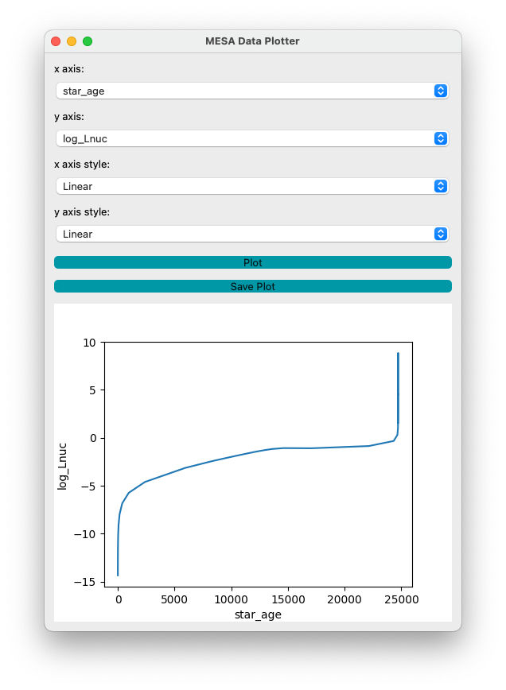

# mesa_gui
A simple Python-based PyQT library GUI to display MESA histories and profiles. The script uses the mesa_reader library to read in LOG files and profiles (not yet implemented), and has drop-down menus to allow the user to quickly select different fields and interactively plot these. 

